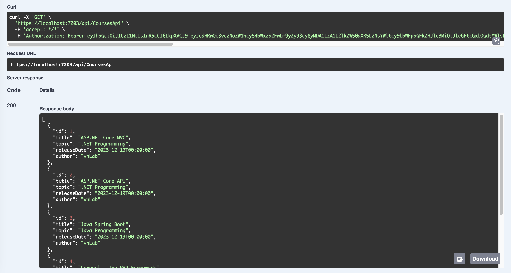

# Part 13: Add Authorization header for Swagger

>**Bearer authentication** (also called **token authentication**) is an [HTTP authentication scheme](https://developer.mozilla.org/en-US/docs/Web/HTTP/Authentication) that involves security tokens called bearer tokens. The name “Bearer authentication” can be understood as “give access to the bearer of this token.” The bearer token is a cryptic string, usually generated by the server in response to a login request.

In this section:

- Add Authorization header for Swagger

Before coming to this guide, please refer to [Part 12: Authentication JWT API with Identity](https://github.com/NguyenPhuDuc307/auth-jwt).

## Add Authorization header for Swagger

Update the following swagger configuration to `Program.cs`:

```c#
// Swagger
builder.Services.AddSwaggerGen(c =>
{
    c.SwaggerDoc("v1", new OpenApiInfo { Title = "Swagger Course Management", Version = "v1" });

    c.AddSecurityDefinition("Bearer", new OpenApiSecurityScheme
    {
        Description = @"JWT Authorization header using the Bearer scheme. \r\n\r\n
                      Enter 'Bearer' [space] and then your token in the text input below.
                      \r\n\r\nExample: 'Bearer 12345abcdef'",
        Name = "Authorization",
        In = ParameterLocation.Header,
        Type = SecuritySchemeType.ApiKey,
        Scheme = "Bearer"
    });

    c.AddSecurityRequirement(new OpenApiSecurityRequirement()
    {
        {
            new OpenApiSecurityScheme
            {
                Reference = new OpenApiReference
                {
                    Type = ReferenceType.SecurityScheme,
                    Id = "Bearer"
                },
                Scheme = "oauth2",
                Name = "Bearer",
                In = ParameterLocation.Header,
            },
            new List<string>()
        }
    });
});
```

## Add the Authentication

Add the following configuring the `Authentication` service:

```c#
//Configuring the Authentication Service
builder.Services.AddAuthentication(opt =>
{
    opt.DefaultAuthenticateScheme = JwtBearerDefaults.AuthenticationScheme;
    opt.DefaultChallengeScheme = JwtBearerDefaults.AuthenticationScheme;
})
.AddJwtBearer(opts =>
{
    //convert the string signing key to byte array

    opts.TokenValidationParameters = new TokenValidationParameters
    {
        ValidateIssuer = true,
        ValidIssuer = jwtOptions!.Issuer,
        ValidateAudience = true,
        ValidAudience = jwtOptions.Audience,
        ValidateLifetime = true,
        ValidateIssuerSigningKey = true,
        ClockSkew = System.TimeSpan.Zero,
        IssuerSigningKey = new SymmetricSecurityKey((byte[]?)Encoding.UTF8
        .GetBytes(jwtOptions!.SigningKey!))
    };
});
```

Finally, use authentication :

```c#
app.UseAuthentication();
```

## Final, run the application to test functions

For Authorization test, add [Authorize] to API Controller:

```c#
[ApiController]
[Authorize]
[Route("api/[controller]")]
public class CoursesApiController : ControllerBase
```

```c#
[ApiController]
[Authorize]
[Route("api/[controller]")]
public class LessonsApiController : ControllerBase
```

Run the following command:

```bash
dotnet watch run
```

Execute `GET: /api/CoursesApi`:


Execute `POST: api/Users/authenticate`:


Choose Authorize in swagger header


Trying execute `GET: /api/CoursesApi`:



Refer to [Bearer Authentication](https://swagger.io/docs/specification/authentication/bearer-authentication/).

Next let's [Part 14: HttpClient](https://github.com/NguyenPhuDuc307/httpclient).
